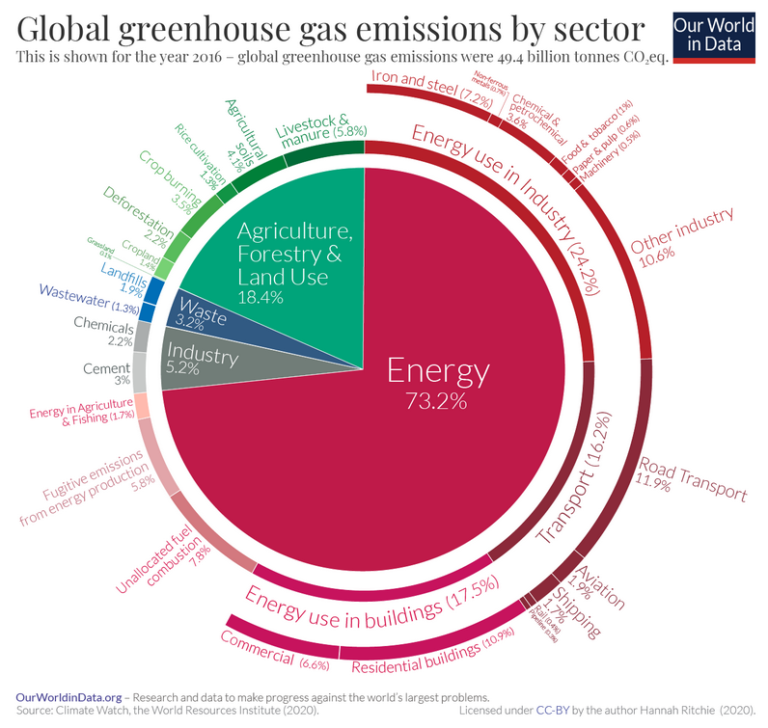
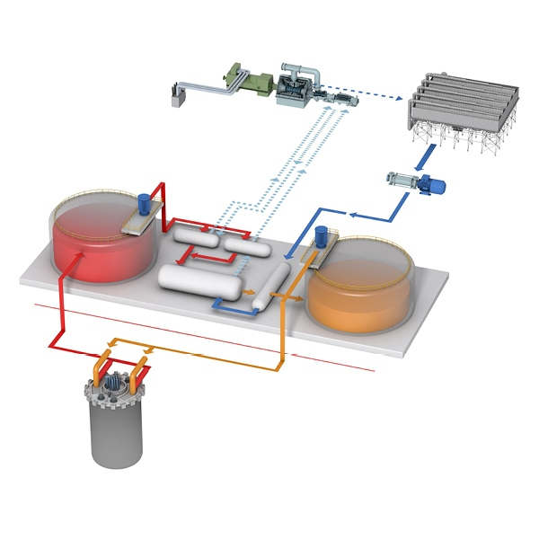

```{r setup, include=FALSE}
knitr::opts_chunk$set(cache = TRUE, message = FALSE, warning = FALSE)
```

## Da dove arrivano le **emissioni di gas a effetto serra** a livello globale?

1. **Produzione di energia**
2. **Agricoltura**
3. **Trattamento rifiuti**
4. **Industria**

5. <div style="text-align:center"></div>

## Produzione di energia

```{r, echo=FALSE}
# Packages
library(ggplot2)

# import data
energia <- read.csv("../dataset/energia.csv")

ggplot(energia, aes(x=year, y=TWh, fill=type)) + 
  geom_area()

```

<p>Granparte dell'energia prodotta deriva da **combustibili fossi**, i quali immettono nell'atmosfera una quantità enorme di **sostanze inquinanti**, come si può notare nel grafico negli ultimi anni l'utilizzo delle energie rinnovabili ha avuto un forte aumento, tuttavia non si è ancora raggiunto un livello tecnologico tale da sostituire totalmente le centrali che utilizzano fonti non rinnovabili.</p>

## Qual è la migliore da utilizzare?

```{r, echo=FALSE}
# Packages
library(ggplot2)

# import data
vittime = read.csv("../dataset/vittime.csv")

ggplot(vittime, aes(x=type, y=decease)) + 
  geom_bar(stat = "identity") +
  coord_flip()+
  theme(axis.title.y=element_blank())

```

<p>**Solare**, **idroelettrico**, **eolico** e **nucleare** sono le fonti che hanno meno morti per TWh prodotto.<br>
Prendendo in considerazione solo le fonti rinnovabili, l'idroelettrico durante tutto il suo ciclo di vita emette circa 34 t di CO2 per GWh prodotto. Solare, eolico e nucleare invece emetto rispettivamente 5, 4 e 3 t di CO2 per GWh prodotto. <br>
Quindi dai dati emerge che il nucleare sia la fonte migliore da utilizzare.</p>

## Il nucleare è sicuro?

<p>Dal punto di vista delle emissioni di *CO2* è la fonte energetica più **sicura** e **green**, come evidenzia anche il grafico precedente.<br>
A questo punto l'attenzione si sposta sulle scorie radioattive, l'esempio che ha fatto più discutere nell'ultimo anno è lo smaltimento delle acque di raffreddamento di Fukushima.<br>
Le quali però sono sottoposte a un doppio filtraggio che ha eliminato quasi la totalità degli elementi radioattivi contenuti in esse, l'unico rimasto è il trizio a causa delle dimensioni troppo piccole.</p>

## Incidenti negli ultimi 50 anni
```{r, echo=FALSE}
# library
library(ggplot2)
library(dplyr)
library(tibble)

# import data
data =read.csv("../dataset/incidenti.csv")

ggplot(data, aes(x=year, y=scale)) +
  geom_point() + 
  geom_label( 
    data=data %>% filter(scale>4), # Filter data first
    aes(label=place),
    nudge_x = 0.25, nudge_y = 0.25, 
    check_overlap = T
  )
```
<p>Negli ultimi 50 anni gli incidenti registrati nelle centrali nucleari sono 34.<br>
Inoltre le centrali stanno diventando sempre più sicure e con controlli più severi.</p>

## Realizzabilità
<p>Bill Gates in collaborazione con la startup TerraPower vuole realizzare entro il 2050 delle mini centrali nucleari per sopperire alle mancanze delle altre fonti di energia rinnovabile, facendo ciò si riuscirà a sostituire completamente le centrali a carbone o a gasolio.</p>
<p>Questo reattore ha un'efficienza di 4 volte maggiore rispetto alle altre fonti rinnovabili ad un costo minore</p>
<div style="text-align:center"></div>
## Fonti
https://www.legambiente.it/sites/default/files/docs/Incidenti_nucleari_degli_ultimi_50_anni.0000002415.pdf
https://ourworldindata.org/
https://www.eni.com/it-IT/ricerca-scientifica/energia-nucleare-europa.html
https://www.terrapower.com/our-work/natriumpower/
